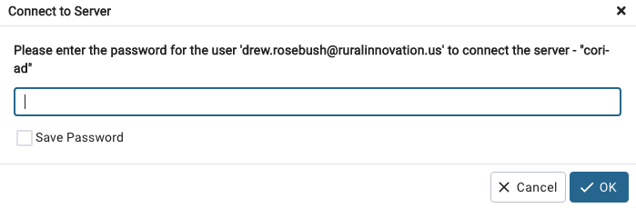

🏗️ This page is under construction! 🏗️
=======================================

------------------------------
## Onboarding team 

Software requirement: PG Admin > 7

### First: in pg_admin:

1. Right clic on `Server` -> Register -> Server
2. New windows pop up:
 * `Name`: cori-ad
 * In the Connection tab
    `Host name/address`: `cori-risi-ad-postgresql.c6zaibvi9wyg.us-east-1.rds.amazonaws.com`
* `Username`: your username (your email)
* `Password`: your password

* What do you have in `Parameters`'s tab? if not add SSL mode as prefer
  
3. Open the "Query tool" and enter:

The "Query tool" look like a small silo: 


To turn the "Query Tool" from "grey" to "black" select the `postgres` DB.

Then enter: 

`ALTER USER "your_username" WITH PASSWORD 'my_secret_pwd';`

Your username need to be double quoted. 

When it displays "Query returned successfully" you should be able to save this password.  

Then you can disconnect from the server and when you reconnect it will ask for your password and you can save it from here: 



### Second: in R

Refer to the coriverse [wiki](https://github.com/ruralinnovation/wiki#installation) and cori.db [readme](https://github.com/ruralinnovation/cori.db) for more details instructions on installing this package.

```r
remotes::install_github("ruralinnovation/cori.db")
packageVersion("cori.db")
# [1] ‘0.2.0’
cori.db::set_db_credentials("your_username", "my_secret_pwd")
# Restart the R session 
```

### Creating schema 

`mda_team` users do not have permission to create `schema`. 

When creating a new schema to allow everyone in a team to access it the ownership need to be changed. 

```sql
ALTER SCHEMA "my_schema" OWNER TO mda_team; 
```

-----------------------------

## Database Migration Update 2023-11-20

https://docs.google.com/document/d/1nuYftMYqEKbH2i_wKhf63Kika7RtEoHb-A7NZYaSPwQ/edit

### Goal Overview:

Use data from the single database instance in our old RDS cluster (cori-risi) to populate the following four new databases instances in our new RDS cluster (cori-risi-ad-postgresql):

  -   **api-dev** - Database used as a development environment with the main purpose of "promoting" data access to api-prod; serves as a test environment for the CORI Data API.

  -   **api-prod** - Database used to serve CORI Data API with data. Highest level of security with limited access. Products will or can be public facing.

  -   **data-prod** - Database used to house vetted, documented, and production level datasets. Potential for very limited data sharing (with collaborators outside the org) with support.

  -   **data** - Database used to support exploratory project work, research data, datasets under development.

We will do this in sequential steps, populating each new database instance one-at-a-time, with the database instance called "data" being the final one (equivalent to the original "data" instance in the old cori-risi RDS cluster). Some schemas will be database-specific from now on, while others (i.e., "metadata") will be common to all instances.

### Glossary:

**Database**: Collection of schemas (data domains), each with a specific set of data tables

**RDS**: AWS service for hosting and administering networked database (DB) clusters

**RDS (cluster)**: Also used to reference a single cluster of databases

**Role**: a generic specification that can do stuff in DB, (example: read_only) . For administration purposes some "group" roles will be a collection of multiple users (example: bb_team )

**User**: a role that can login (example: Olivier)

### Basic activities plan:

1.  "Dumping" existing schemas in old RDS (pg_dump) (Oct 25, 2023~ Nov 1, 2023)

  -   Schemas intended for data-prod will be manually dumped/restored (by Olivier Nov 1, 2023)

  -   (MDA Team:) Should we restore these schemas? If yes, into which database?

      1.  Historical_census_data

          1.  Used in RWJF story 2

          2.  Not actively developed

          3.  Will not restore

      2. sch_layers

          1.  Carto layers...

          2.  Version of higher ed drive times (last run?)

          3.  Will not restore

      3. sch_source

          1.  Dumping ground during ETL

          2.  Practice question: how should we deal with storing intermediate data in db?

              1.  Utilize S3; document bucket/path in code README

          3. Will not restore; absence of schema will break some scripts

      4. vt_broadband

          1.  Old VT 10 year work

          2.  Will not restore

2. Creating group roles (and clean a bit manually) for administrative management in new RDS (Oct 31, 2023)

3. Creating new database instances in new RDS (Active Directory secured)

  -   Populate them in this order:

      1.  api-dev (Nov 1, 2023)

      2.  -> api-prod (Nov 2, 2023)

      3.  -> data-prod (Nov 6, 2023~ Nov 9, 2023)

          1.  ~~This will use schemas manually dumped/restored (by Olivier)~~
          2. We actually used `ansible` for both dumping schemas and restoring them to the individual database instances.

      4.  -> data (Nov 13, 2023)

  -   Check-in AK and BB team about down-time (November 9)

  -   Check-in Nora and RII team about down-time (November 9)

  -   Notify Org about app down-time (Nov 2, 2023)

  -   Set time with Nahum (MF) for API re-deploy/testing (Nov 2, 2023?)

  -   Re-deploy [Broadband Climate Risk Mitigation Tool](https://broadband-risk.ruralinnovation.us/#about) with downtime notification

4. Creating users with role assignments to access the new database instances

  -   Maintaining a version-controlled YAML file as the source of truth on who can connect to what (and how)

      1.  db_password should be a shell env.

      2.  What happens if users already exist and have set a password? (avoid idempotency; password reset -> `no_password_changes:` is taking that into account )

5.  (Re-)Connecting "client" apps/tools to each new database instance (Nov 6, 2023-10)

  -   Prerequisite: updating cori.db (remember to increment the version)

      1.  Set credential function (Nov 6, 2023)

      2.  Connect to db functions (Nov 6, 2023)

          1.  Specify search path in params

          2.  Adding one function to connect to data-prod (November 6)

  -   R processes/scripts (including DoctR => TED data pipeline)

  -   Re-deploy some of our shiny apps (TED, WIM, CORI Explorer) to shinyapps.io (November 9)

      1.  Required: uses .Renviron for db credentials

  -   Re-deploy API (November 2)

  -   Re-deploy BCAT and Broadband Risk Mitigation (CH) (TBD)

6. Testing functionality (November 6; ongoing)

7. Onboard BB team

  -   [BB <=> MDA Database onboarding (2.0)](https://docs.google.com/document/d/1fI_CZfnhevlBxzsmlrTnhlWHun3JMYqf61b7QkXiHts) (Nov 29, 2023)

8. Shut down old server RDS cluster (November 20)

9. Sharing (developing) best practices going forward (TBD)

  -   Writing/Updating documentation:

      1.  Architecture overview

      2. cori.db docmentation ([README](https://github.com/ruralinnovation/cori.db))

      3.  Data content/variables overview -

          1.  [CORI EXPLORER](https://ruralinnovation.shinyapps.io/CORI_Explorer_BETA/)

          2. <https://rpubs.com/drewrose/data_documentation>

          3. <https://ruralinnovation.github.io/data_documentation/>

      4.  Adding users

           1.  Self-managed password (procedures when pwd is forgotten/lost)?

      5.  Moving data

  -   Examples:

      1.  Data set handling: data that is "in-process/progress" stays in the data db instance. Metadata is essential and required for any data set that will be moved to the api-prod or data-prod db instances.

      2.  Queries: Use less *, use alias (AS) and WHERE to help homogenize input in R or other scripting tools

### Appendix:

Some examples of role inheritance:
- Drew (User) <- mda_team ("group") <- read_and_write (roles)

- Kirstin (User) <- bb_team("group") <- read_only (roles)

- Shinybot1 (User) <- bot ("group") <- read_only (roles)

- Collaborator_bill (User) <- group <- read_only (roles)

### Follow-up:

- [ ] Create architecture diagram

- [ ] Plan for communicating/social db best practices

- [X] AWS costs (pull invoices):

    1. November 2023

    2. November 2022

    3. Compare change in RDS costs with [Drew Rosebush](mailto:drew.rosebush@ruralinnovation.us)

-----------------------------

## Database Migration 2023-03-10

## Goals: 

- [X] Reduce the size (50% ? we can always increase)
- [X] Upgrade Postgres version (15)
- [X] Upgrade PostGIS version (3.X)
- [X] Defining Roles/Users
- [x] Split DB: yes 4 DB 
- List remaining Challenges
    - Process to update data
    - Process to consolidate/clean/document previous data 
    - Process to archive data
    - documentations
    - merge branches / clean Ansible repo
    - individual password reset from ansible
- Onboard bb team -> meeting 29/11
- Drop the previous instance (last dump?)


The [list of Drew](https://rpubs.com/drewrose/data_documentation) is a great start how can we improve it? 

I think it is outside of the scope of migrating DB but we should at least link the two and we should add a specific ticket/process on how we can build a better version of it.  

What is important is how long should we keep data for every source. If I am correct we are tracking the DB with a shiny app that target the metadata schema. In my opinion it is a good idea one question I am unclear is when do we update metadata: right after writing anything? after the data is in "production" ? (other option). When we are storing past data we should think who do we clean metadata.

The ansible repo can be used has a documentation on how the schema were dump and restore:   

    - **Schemas dumps**: https://github.com/ruralinnovation/ansible/blob/dce9174cbcd65bf6533a6a4516764d6760ea902c/playbooks/cori-risi-old-db/README.md   
    
    - **schema per databases** https://github.com/ruralinnovation/ansible/tree/dce9174cbcd65bf6533a6a4516764d6760ea902c/playbooks/cori-risi-ad-postgresql/vars   

### Data lifecycle?

Currently, we just have one DB and multiple schemas.

I will divide with at least:

- projects  
    - schema for specific projects  
    - staging place at schema level 
    - can be called by bots 
    - no limitation in writing/reading
- sources 
    - mostly some raw data could be redundant with data 
    - can't be called by bots
    - more limited writing 
- data   
    - Data that we need frequently and has been processed by us 
    - Can be called by bots?
    - no limitation in writing/reading

This three seems to have different lifecycle (ie when we update them/store them/delete part of them)


# list of schemas and tables that can be in prod env.

**Rules**: 

data in prod must have metadata before pushing into prod. 

Metadata is: 

* required:
    - A readme.md in a repo with description of data (dimensions and what is a "row") and the above (should be at the schema )  
    - "cookbook" at tables -> `metadata` 
    - Sources (link, date, last_updated)  
    - Licenses (PD, MIT, Apache 2 etc )
    - "executive summary description": one-liner providing a quick overview of what the data is 
      
    
* optional:
    - s3 bucket with raw
    - Codes that produce table
    - validation tests   
        * summary of validation tests  
        * testing `metadata` columns
        * 
TODO stuff: 

- [ ] build metadata for broadband resiliency CH tools
- [ ] Figure out what do we do when Olivier update FCC data
- [ ] Cori explorer should also include being in prod or dev or something like that
    
- [ ] Organize a bit what we need inside of bcat, keeping in mind that we also could want that in data prod
- [ ] very low priority build f477 last one and having code for it


## TED 

shinyapp: 
- entry point app.R
- it is unsing cori.apps for component 
- it is using doctR and doctR needs fonts
- renv.lock is used by shinyapps.io to download the correct packages and version
- it needs core_data


