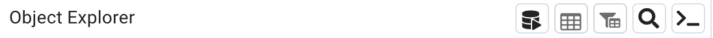

🏗️ This page is under construction! 🏗️
=======================================

------------------------------
## Onboarding team 

Software requirement: PG Admin > 7

### First: in pg_admin:

1. Right clic on `Server` -> Register -> Server
2. New windows pop up:
 * `Name`: cori-ad
 * In the Connection tab
    `Host name/address`: `cori-risi-ad-postgresql.c6zaibvi9wyg.us-east-1.rds.amazonaws.com`
* `Username`: your username (your email)
* `Password`: your password

* What do you have in `Parameters`'s tab? if not add SSL mode as prefer
  
3. Open the "Query tool" and enter:

The "Query tool" look like a small silo: 



To turn the "Query Tool" from "grey" to "black" select the `postgres` DB.

Then enter: 

`ALTER USER "your_username" WITH PASSWORD 'my_secret_pwd';`

Your username need to be double quoted. 

When it displays "Query returned successfully" you should be able to save this password.  

Then you can disconnect from the server and when you reconnect it will ask for your password and you can save it from here: 


### Second: in R

Refer to the coriverse [wiki](https://github.com/ruralinnovation/wiki#installation) and cori.db [readme](https://github.com/ruralinnovation/cori.db) for more details instructions on installing this package.

```r
remotes::install_github("ruralinnovation/cori.db")
packageVersion("cori.db")
# [1] ‘0.2.0’
cori.db::set_db_credentials("your_username", "my_secret_pwd")
# Restart the R session 
```

### Creating schema 

`mda_team` users do not have permission to create `schema`. 

When creating a new schema to allow everyone in a team to access it the ownership need to be changed. 

```sql
ALTER SCHEMA my_schema OWNER TO mda_team; 
```

-----------------------------
## Database Migration Status: 2023-11-20

## Goals: 

- [X] Reduce the size (50% ? we can always increase)
- [X]  Upgrade Postgres version (15)
- [X] Upgrade PostGIS version (3.X)
- [X] Defining Roles/Users
- [x] Split DB: yes 4 DB 
- List remaining Challenges
    - Process to update data
    - Process to consolidate/clean/document previous data 
    - Process to archive data
    - documentations
    - merge branches / clean Ansible repo
    - individual password reset from ansible
- Onboard bb team -> meeting 29/11
- Drop the previous instance (last dump?)


The [list of Drew](https://rpubs.com/drewrose/data_documentation) is a great start how can we improve it? 

I think it is outside of the scope of migrating DB but we should at least link the two and we should add a specific ticket/process on how we can build a better version of it.  

What is important is how long should we keep data for every source. If I am correct we are tracking the DB with a shiny app that target the metadata schema. In my opinion it is a good idea one question I am unclear is when do we update metadata: right after writing anything? after the data is in "production" ? (other option). When we are storing past data we should think who do we clean metadata.

The ansible repo can be used has a documentation on how the schema were dump and restore: 
    - **Schemas dumps**: https://github.com/ruralinnovation/ansible/blob/dce9174cbcd65bf6533a6a4516764d6760ea902c/playbooks/cori-risi-old-db/README.md 
    - **schema per databases** https://github.com/ruralinnovation/ansible/tree/dce9174cbcd65bf6533a6a4516764d6760ea902c/playbooks/cori-risi-ad-postgresql/vars

### Data lifecycle?

Currently we just have one DB and multiple schemas.

I will divide with at least:

- projects  
    - schema for specific projects  
    - staging place at schema level 
    - can be called by bots 
    - no limitation in writing/reading
- sources 
    - mostly some raw data could be redundant with data 
    - can't be called by bots
    - more limited writing 
- data   
    - Data that we need frequently and has been processed by us 
    - Can be called by bots?
    - no limitation in writing/reading

This three seems to have different lifecycle (ie when we update them/store them/delete part of them)


# list of schemas and tables that can be in prod env.

**Rules**: 

data in prod must have metadata before pushing into prod. 

Metadata is: 

* required:
    - A readme.md in a repo with description of data (dimensions and what is a "row") and the above (should be at the schema )  
    - "cookbook" at tables -> `metadata` 
    - Sources (link, date, last_updated)  
    - Licenses (PD, MIT, Apache 2 etc )
    - "executive summary description": one liner providing a quick overview of what the data is 
      
    
* optional:
    - s3 bucket with raw
    - Codes that produce table
    - validation tests   
        * summary of validation tests  
        * testing `metadata` columns
        * 
TODO stuff: 

- [ ] build metadata for broadband resiliency CH tools
- [ ] Figure out what do we do when Olivier update FCC data
- [ ] Cori explorer should also include being in prod or dev or something like that
    
- [ ] Organize a bit what we need inside of bcat, keeping in mind that we also could want that in data prod
- [ ] very low priority build f477 last one and having code for it


## TED 

shinyapp: 
- entry point app.R
- it is unsing cori.apps for component 
- it is using doctR and doctR needs fonts
- renv.lock is used by shinyapps.io to download the correct packages and version
- it needs core_data


