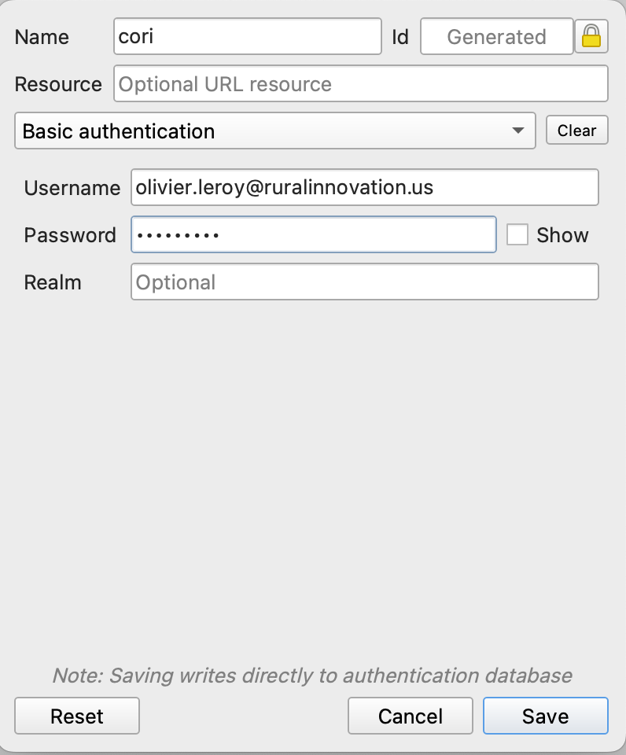

This will include some materials for the use of QGIS

## Connecting QGIS to CORI RDS DB

In QGIS: 

 1. `QGIS` -> `Preferences` -> `Authentication`

 2. In Authentication use the green ➕ to add a new way of doing it.

If it is the first time it will ask you to set up a master password (I think it is just for mac).

 3. Use the drop down menu to select `Basic authentication`

 4. Pick a name: I am using `cori` 

 5. Provide the correct Username and Password

It should look like this: 

In QGIS `Browser`: 

 1. Right click on `PostgreSQL` 

 2. `New connections` 

 3. Pick a name (again I am using `CORI`)

 4. Host: our aws RDS 

 5. Port: we are using the default one (5432)

 6. Database name: the name of the DB

 7. In `Athentication` select the previous configurations we have done

 8.  You can "Test Connection" 

If it is good you can press `ok` if not review the Host name other parameters.

You should be able to browse `schemas` and `tables` from the database.
  

### Resources: 

QGIS LTR Doc:  https://docs.qgis.org/3.28/en/docs/user_manual/auth_system/auth_overview.html 

To interact with QGIS in R: https://r-spatial.github.io/qgisprocess/ 

