::: callout-tip
*Note: DO NOT EDIT THIS README IN THE [`coriverse`](https://github.com/ruralinnovation/coriverse.git) REPO. It is derived from [`README.Rmd`](https://github.com/ruralinnovation/wiki/edit/main/README.Rmd) in the [`wiki`](https://github.com/ruralinnovation/wiki.git) repo.*
:::

# Enter the coriverse!


The [`coriverse`](https://github.com/ruralinnovation/coriverse/) is an effort to develop a standard set of best practices for the MDA team, centralize important or useful functions into an easily accessible location, and manage package dependencies for our scripts.

It's also an `R` package!

It will import:

-   [`cori.charts`](https://github.com/ruralinnovation/cori.charts/)
-   [`cori.data`](https://github.com/ruralinnovation/cori.data/)
-   [`cori.db`](https://github.com/ruralinnovation/cori.db/)
-   [`cori.utils`](https://github.com/ruralinnovation/cori.utils/)

It will only attach:

-   `cori.db`
-   `cori.utils`

## Initial Setup

This package can be installed by using `devtools` or `remotes`.

### Setup for Development

Once you have all the dependencies installed, to build and install this package from the local project directory, run:

``` r
pkgbuild::clean_dll(); pkgbuild::compile_dll(); devtools::document(); devtools::check(); devtools::install();
```

### Why `R`

[`R`](https://www.r-project.org/) is used for several reasons. The first one is probably historical: at the beginning the team had a lot of `R` users. Now `R` is used as our main "glue" language. It fills the gap between the data analysis requirements and the data engineering and software development requirements of our various projects.

We do not have a full IT department and a lot of our solutions are "hand made" we cannot afford to spend times managing conda/venv setup. `R`, thanks to [CRAN](https://cran.r-project.org/), offers a good [selection of packages](https://cran.r-project.org/web/packages/index.html) without a need for too much investment.

`R` also offers a mature geospatial data ecosystem, wrappers around API(s) for our data sources (e.g., US census data), literate programming experience with Rmarkdown and Quarto, great data visualizations packages (i.e., `ggplot2`, `shiny`), and is probably on top for statistical analysis and modeling.

[Rstudio](https://posit.co/products/open-source/rstudio/) is a good and free IDE that can be run on a server or desktop, but `R` also integrates with [VScode](https://code.visualstudio.com/download) or emacs.

Finally, the strong focus on producing good documentation and a lively community make it a fun ecosystem to interact with!

### Install `R` on Mac OS X

If you are installing the `R` language on your system for the first time, we recommend that you do *not* use the `homebrew` client to manage your installation. You should begin by ensuring that the command-line component for [Xcode](//apps.apple.com/us/app/xcode/id497799835?mt=12) is available on your system and that GNU Fortran has been installed from this [source](//cran.r-project.org/bin/macosx/tools/):

-   [gfortran-12.2-universal.pkg](//mac.r-project.org/tools/gfortran-12.2-universal.pkg)
-   [Xcode](//download.developer.apple.com/Developer_Tools/Command_Line_Tools_for_Xcode_15.1/Command_Line_Tools_for_Xcode_15.1.dmg)

Once these prerequisites are installed, head over to [CRAN](//cran.r-project.org/bin/macosx/) and download the latest version of `R` for macOS 11 (and higher; `R` version [`4.3.2`](//cran.r-project.org/bin/macosx/big-sur-arm64/base/R-4.3.2-arm64.pkg) as of the last update to these instructions).

### Environment variables

After installing `R`, you need to first set up local environment variables, either through your shell profile (preferably) or with an `.Renviron` file.

`~/.profile`:

```         
export GITHUB_USER='<your-github-user-name>'
export GITHUB_PAT='<your-github-personal-authentication-token>'
```

`~/.Renviron`:

```         
GITHUB_USER="<your-github-user-name>"   
GITHUB_PAT="<your-github-personal-authentication-token>"
```

### Installation

`coriverse` is an `R` metapackage, allowing us to conveniently install component `R` packages that address different pieces of the MDA workflow. To install, use the following steps:

1.  Ensure you have :package: `remotes` 2.4.0 or greater installed (current version as of June 2021) and `usethis`. Use `install.packages('remotes'); install.packages('usethis')` to get the latest version.
2.  Create a GitHub token:

``` r
    ## (optional, if not previously done) set your user name and email:
    # usethis::use_git_config(user.name = "YourName", user.email = "your@mail.com")
    
    ## create a personal access token for authentication:
    usethis::create_github_token() 
    ## in case usethis version < 2.0.0: usethis::browse_github_token() (or even better: update usethis!)
    ## 2023-01-25: it opens the default web browser at github PAT web page see 1.

    ## set personal access token:
    credentials::set_github_pat("ghp_...")
```

3.  Set an environment variable called `GITHUB_PAT` by running `Sys.setenv(GITHUB_PAT = 'MY_TOKEN_HERE')`, replacing MY_TOKEN_HERE with the valid GitHub personal access token you previously created. Instructions for creating a Personal Access Token are available in [GitHub's documentation](https://docs.github.com/en/github/authenticating-to-github/creating-a-personal-access-token). Your PAT only needs `repo` permissions (the first section of options when creating a PAT).


2024: In ubuntu (debian) the environmant variable specifying the users libpath (path for user installed library) was not loaded correctly. This was problemating for packages build by user (example with `install_github`) because they did not have access to `/usr/lib/R etc ...` (or need to sudo). 

Either in `/etc/R/Renviron` or `/etc/R/Renviron.site` R_LIBS_USER need to be specified. We went with adding `~/R/x86_64-pc-linux-gnu-library/4.4` and then create the directory (if the directory is not created R will not create it). 

```bash
mkdir -p ~/R/x86_64-pc-linux-gnu-library/4.4
```

References about it: 

- https://cran.r-project.org/bin/linux/ubuntu/fullREADME.html#maintenance-of-r-packages

- https://stat.ethz.ch/R-manual/R-patched/library/base/html/Startup.html

4.  Use the `install_github()` function to install the coriverse package(s), which will look for the environment variable GITHUB_PAT and will allow you to install packages from private repos. Call:

``` r
    remotes::install_github('ruralinnovation/coriverse')
```

*For instructions on programmatically connecting to the database using the coriverse, see [cori.db](https://github.com/ruralinnovation/cori.db/)*

------------------------------------------------------------------------

# Database Access For New Users

See the [Database Onboarding](onboarding_team_db.md) section in the [wiki](https://ruralinnovation.github.io/wiki/).

------------------------------------------------------------------------

# Development Process for New `coriverse` Functions

1.  Create a branch of the appropriate `coriverse` package repo
2.  Write a function. All functions from external packages should reference the package with :: syntax (e.g. dplyr::filter())
3.  Save the function in the `R` folder of the appropriate coriverse package repo in your branch. The file name should match the function name.
4.  Insert a roxygen skeleton (CTRL + SHIFT + ALT + R in RStudio)
5.  Update the title, documentation of the parameters, and the return value. Add an `@import` tag for each package the function depends on. If the function uses only one or two functions from an external package, use an `@importFrom` tag for each function.
6.  If the packages the function depends on do not appear in the Imports field of the DESCRIPTION file, add the package name(s) there
7.  Run `devtools::document()`
8.  Run `devtools::check()`
9.  If the check passes with no errors, warnings, or notes, push to your branch. Otherwise, resolve errors, warnings, and notes.
10. Open a pull request and contact another MDA team member for review.

1-7 are parts of "The Whole Game", the 1st chapter in the *Getting Started* section of [**R Packages**](https://r-pkgs.org/) from Hadley Wickham and Jenny Bryan and can be visualized here:



```{=html}
<!--
<a href="https://r-pkgs.org/whole-game.html" target="_blank">

</a>
_Visualizing "the Whole Game"_
-->
```
<hr />

## Setup for Development

Once you have all the dependencies installed, to build and install this package from the local project directory, run:

``` r
pkgbuild::clean_dll(); pkgbuild::compile_dll(); devtools::document(); devtools::check(); devtools::install();
```

### Using AWS S3 for data storage

Within our workflows, you may need access to AWS S3 for both data storage and retrieval which means you will need to set your AWS credentials within the R runtime environment. The `cori.db::set_aws_credentials` function can be used to do this. The following example is of using DuckDB to pull data from both a public and a private S3 bucket (i.e., repository/store), the latter requiring credentials (redacted as "\###") for an AWS IAM user account that has read access to the bucket (to learn more about DuckDB see [Arrow & DuckDB](duckDB.qmd)):

```{r}
#| eval: false

library(DBI)
library(cori.db)
library(duckdb)

Sys.getenv("AWS_ACCESS_KEY_ID")
Sys.getenv("AWS_SECRET_ACCESS_KEY")

# DuckDB example:
con <- DBI::dbConnect(duckdb::duckdb(), dbdir = "data/erc_sample.duckdb")
duckdb::dbSendQuery(con, "INSTALL json;")
duckdb::dbSendQuery(con, "LOAD json;")
duckdb::dbSendQuery(con, "INSTALL httpfs;")
duckdb::dbSendQuery(con, "LOAD httpfs;")
duckdb::dbSendQuery(con, "INSTALL aws;")
duckdb::dbSendQuery(con, "LOAD aws;")


# Select data from public S3 bucket to local data.frame
erc_sample <- DBI::dbGetQuery(con, "SELECT * FROM read_json_auto('s3://erc-public/test/erc_sample.json')")
nrow(erc_sample)
# [1] 316815

# Select data from *non-public S3 bucket to local data.frame *without S3 credentials
usa_spending <- DBI::dbGetQuery(con, "SELECT * FROM read_csv('s3://usaspending-data/usaspending_api_pull.csv')")
# Error:
#   HTTP Error: HTTP GET error on 'https://usaspending-data.s3.amazonaws.com/usaspending_api_pull.csv' (HTTP 403)

# Initilialize S3 credentials (this only needs to be done once for a given project)
cori.db::set_aws_credentials(keyID = "###", accesKey = "###")

# Configure duckdb connection with current credentials
duckdb::dbSendQuery(con, "CREATE OR REPLACE SECRET s3_secret (
    TYPE S3,
    PROVIDER CREDENTIAL_CHAIN,
    CHAIN 'env;config'
);")

# Select data from *non-public S3 bucket to local data.frame
usa_spending <- DBI::dbGetQuery(con, "SELECT * FROM read_csv('s3://usaspending-data/usaspending_api_pull.csv')")
nrow(usa_spending)
# [1] 1129824

DBI::dbDisconnect(con)


```

These are the steps for creating a new (private) S3 bucket:

1.  To create a new `bucket` use the `create bucket` orange button.

**Naming convention of bucket:**

-   for project do: `pro-<NAME_OF_PROJECT>`, example: `proj-rwjf`\
-   for data used in multiple project: `<NAME_OF_PROJECT>-data`, example: `puma-data`

(⚠️ no uppercase, see [here](https://docs.aws.amazon.com/AmazonS3/latest/userguide/bucketnamingrules.html))

*We keep the default values and press `create bucket` at the bottom of the page (UX can change a bit over time).*

2.  Inside the bucket use the upload button top open a new web page were you can drag and drop the file you need to upload

3.  Do not forget to click the upload button at the bottom of this page (it will open a new page with the status of the upload).