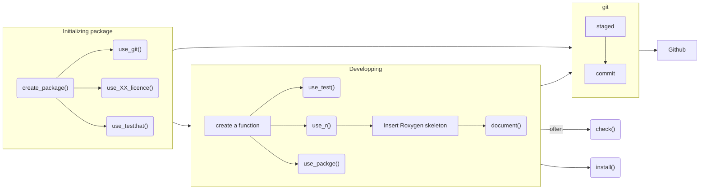

# Welcome to the coriverse!


The [`coriverse`](https://github.com/ruralinnovation/coriverse/) is an
effort to develop a standard set of best practices for the MDA team,
centralize important or useful functions into an easily accessible
location, and manage package dependencies for our scripts.

It will import:

- [`cori.charts`](https://github.com/ruralinnovation/cori.charts/)
- [`cori.data`](https://github.com/ruralinnovation/cori.data/)
- [`cori.db`](https://github.com/ruralinnovation/cori.db/)
- [`cori.utils`](https://github.com/ruralinnovation/cori.utils/)

It will only attach:

- `cori.db`
- `cori.utils`

## Initial Setup

In order to install this package (using `devtools` or `remotes`), you
need to first set up local environment variables, either through your
shell profile (preferably) or with an `.Renviron` file.

`~/.profile`:

    export GITHUB_USER='<your-github-user-name>'
    export GITHUB_PAT='<your-github-personal-authentication-token>'

`~/.Renviron`:

    GITHUB_USER="<your-github-user-name>"   
    GITHUB_PAT="<your-github-personal-authentication-token>"

------------------------------------------------------------------------

# Installation

`coriverse` is an R metapackage, allowing us to conveniently install
component R packages that address different pieces of the MDA workflow.
To install, use the following steps:

1.  Ensure you have :package: `remotes` 2.4.0 or greater installed
    (current version as of June 2021) and `usethis`. Use
    `install.packages('remotes'); install.packages('usethis')` to get
    the latest version.
2.  Create a GitHub token:

``` r
Simple include function, similar to C/C++. The context assumes that you're either
passing an .R script at a given path to the Rscript command or interactively executing
R code within the Rstudio console. Other uses of this function will require an absolute
path in the function argument.
    ## (optional, if not previously done) set your user name and email:
    # usethis::use_git_config(user.name = "YourName", user.email = "your@mail.com")
    
    ## create a personal access token for authentication:
    usethis::create_github_token() 
    ## in case usethis version < 2.0.0: usethis::browse_github_token() (or even better: update usethis!)
    ## 2023-01-25: it opens the default web browser at github PAT web page see 1.

    ## set personal access token:
    credentials::set_github_pat("ghp_...")
```

3.  Set an environment variable called `GITHUB_PAT` by running
    `Sys.setenv(GITHUB_PAT = 'MY_TOKEN_HERE')`, replacing MY_TOKEN_HERE
    with the valid GitHub personal access token you previously created.
    Instructions for creating a Personal Access Token are available in
    [GitHub’s
    documentation](https://docs.github.com/en/github/authenticating-to-github/creating-a-personal-access-token).
    Your PAT only needs `repo` permissions (the first section of options
    when creating a PAT).


4.  Use the `install_github()` function to install the coriverse
    package(s), which will look for the environment variable GITHUB_PAT
    and will allow you to install packages from private repos. Call:

``` r
    remotes::install_github('ruralinnovation/coriverse')
```

*For instructions on programmatically connecting to the database using
the coriverse, see
[cori.db](https://github.com/ruralinnovation/cori.db/)*

------------------------------------------------------------------------

# Database Access For New Users

See the [Database Onboarding](onboarding_team_db.md) section in the
[wiki](https://ruralinnovation.github.io/wiki/).

------------------------------------------------------------------------

# Development Process for New `coriverse` Functions

1.  Create a branch of the appropriate `coriverse` package repo
2.  Write a function. All functions from external packages should
    reference the package with :: syntax (e.g. dplyr::filter())
3.  Save the function in the R folder of the appropriate coriverse
    package repo in your branch. The file name should match the function
    name.
4.  Insert a roxygen skeleton (CTRL + SHIFT + ALT + R in RStudio)
5.  Update the title, documentation of the parameters, and the return
    value. Add an `@import` tag for each package the function depends
    on. If the function uses only one or two functions from an external
    package, use an `@importFrom` tag for each function.
6.  If the packages the function depends on do not appear in the Imports
    field of the DESCRIPTION file, add the package name(s) there
7.  Run `devtools::document()`
8.  Run `devtools::check()`
9.  If the check passes with no errors, warnings, or notes, push to your
    branch. Otherwise, resolve errors, warnings, and notes.
10. Open a pull request and contact another MDA team member for review.

1-7 are parts of “the whole game”, 2nd chapter of [R
Packages](https://r-pkgs.org/) from Hadley Wickham and Jenny Bryan and
can be visualize here:



## Setup for Development

Once you have all the dependencies installed, to build and install this
package from the local project directory, run:

``` r
pkgbuild::clean_dll(); pkgbuild::compile_dll(); devtools::document(); devtools::check(); devtools::install();
```

# Storing Data in S3

You will need access to the s3 storage.

1.  To create a new `bucket` use the `create bucket` orange button.

**Naming convention of bucket:**

- for project do: `pro-<NAME_OF_PROJECT>`, example: `proj-rwjf`  
- for data used in multiple project: `<NAME_OF_PROJECT>-data`, example:
  `puma-data`

(⚠️ no uppercase, see
[here](https://docs.aws.amazon.com/AmazonS3/latest/userguide/bucketnamingrules.html))

*We keep the default values and press `create bucket` at the bottom of
the page (UX can change a bit over time).*

2.  Inside the bucket use the upload button top open a new web page were
    you can drag and drop the file you need to upload

3.  Do not forget to click the upload button at the bottom of this page
    (it will open a new page with the status of the upload).
