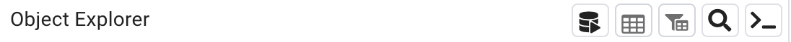
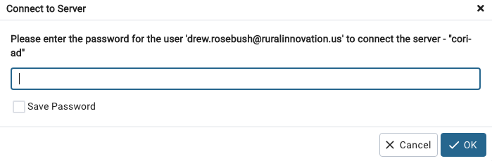

## Database Onboarding

- Software requirement: [pgAdmin 4 > v7](https://www.pgadmin.org/download)

Most CORI Computer are Mac: https://www.postgresql.org/ftp/pgadmin/pgadmin4/v7.8/macos/

- Your IP address should have been whitelisted, if not contact John or Olivier.  

### First: in pgAdmin

1. Right clic on `Server` -> Register -> Server
2. New windows pop up:
 * `Name`: cori-ad
 * In the Connection tab
    `Host name/address`: `cori-risi-ad-postgresql.c6zaibvi9wyg.us-east-1.rds.amazonaws.com`
* `Username`: your username (your email)
* `Password`: your password

* What do you have in `Parameters`'s tab? if not add SSL mode as prefer
  
3. Open the "Query tool" and enter:

The "Query tool" look like a small silo: 



To turn the "Query Tool" from "grey" to "black" select the `postgres` DB.

Then enter: 

`ALTER USER "your_username" WITH PASSWORD 'my_secret_pwd';`

Your username need to be double quoted. 

When it displays "Query returned successfully" you should be able to save this password.  

Then you can disconnect from the server and when you reconnect it will ask for your password and you can save it from here: 



### Second: in R

Refer to the coriverse [wiki](https://github.com/ruralinnovation/wiki#installation) and cori.db [readme](https://github.com/ruralinnovation/cori.db) for more details instructions on installing this package.

```r
remotes::install_github("ruralinnovation/cori.db")
packageVersion("cori.db")
# [1] ‘0.2.0’
cori.db::set_db_credentials("your_username", "my_secret_pwd")
# Restart the R session 
```

### Creating a schema 

`mda_team` users do not have permission to create `schema`. 

When creating a new schema to allow everyone in a team to access it the ownership need to be changed. 

```sql
ALTER SCHEMA "my_schema" OWNER TO mda_team; 
```
